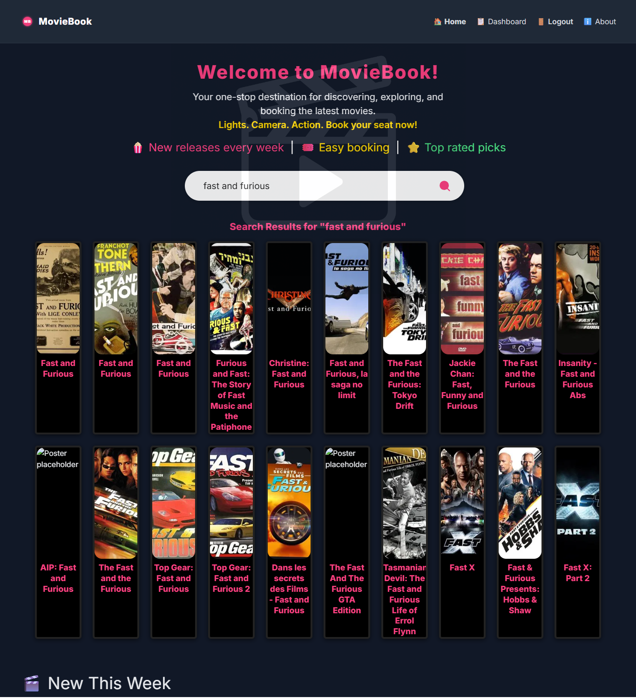
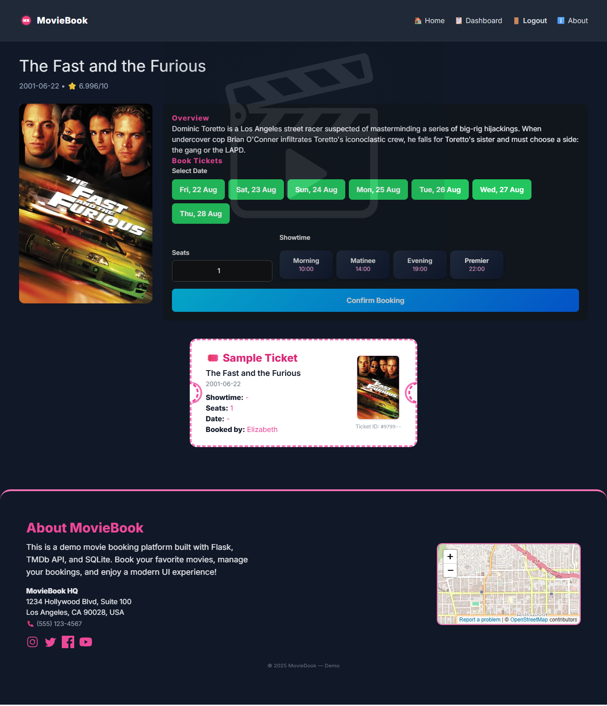
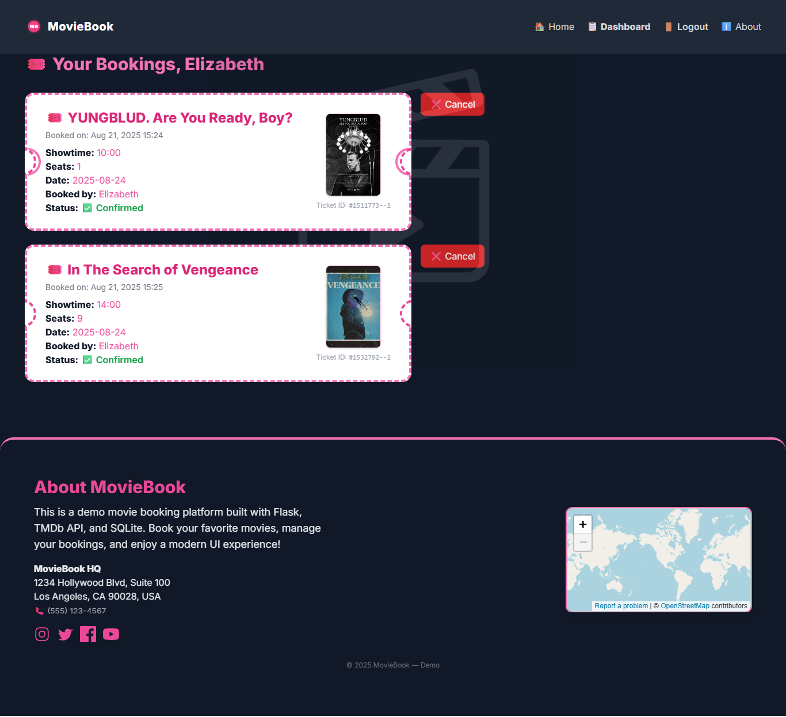
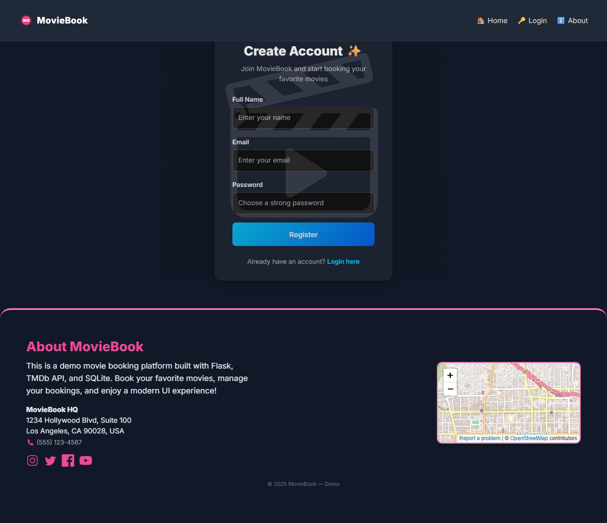
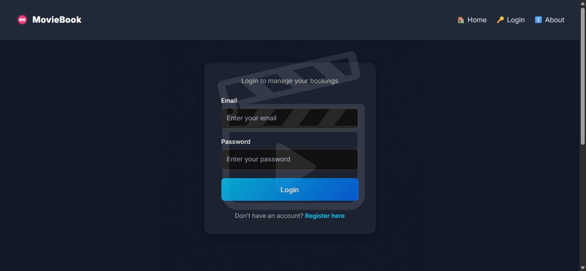
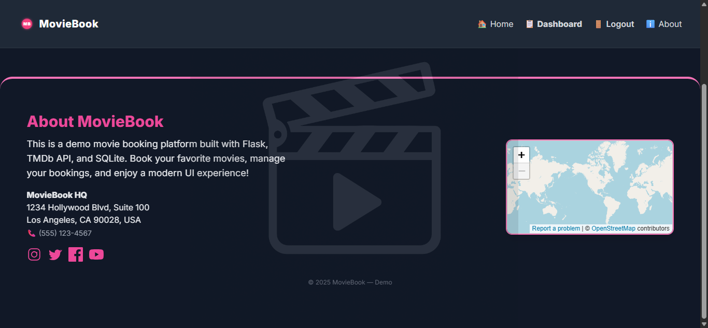

<p align="center">
	
</p>

# MovieBook

A modern, full-featured movie booking platform built with Flask, SQLAlchemy, and the TMDb API. MovieBook lets users browse, search, and book tickets for the latest movies with a beautiful, responsive UI.

---

## 🚀 Features
- Browse recent movies by genre (last 7 days)
- Google-style search for any movie (TMDb API)
- Book tickets (date, showtime, seats)
- User registration and login (Flask-Login)
- Dashboard with ticket preview, ticket ID, and cancellation
- Creative UI: large logo background, genre reels, overlays, and ticket cards
- About section with address, map, and social icons
- Feedback messages for all actions (login, register, booking, cancel)
- Prevent duplicate bookings for the same movie, showtime, and date

---

## 🖼️ Screenshots

### Home Page


### Search Results


### Movie Details & Booking


### Dashboard (My Bookings)


### Registration


### Login


### About Section



---

## 🛠️ Tech Stack
- Python 3, Flask, Flask-Login, SQLAlchemy
- Jinja2 templating
- TMDb API for movie data
- SQLite (default, easy to swap for Postgres/MySQL)
- Tailwind CSS, custom CSS, and SVG icons

---

## 📁 Folder Structure

```
movie booking/
│
├── app.py                # Main Flask app
├── models.py             # User and Booking models
├── booking.py            # (legacy, now unused)
├── static/
│   ├── css/style.css     # Custom styles
│   └── img/              # Logo, posters, etc.
├── templates/
│   ├── base.html         # Main layout
│   ├── index.html        # Homepage
│   ├── movie.html        # Movie details & booking
│   ├── dashboard.html    # User dashboard
│   ├── login.html        # Login page
│   ├── register.html     # Registration page
│   ├── about.html        # About section (legacy)
│   └── booking_cancelled.html # Cancel overlay
├── instance/
│   └── bookings.db       # SQLite database
├── cache/                # Cached API responses
├── screenshots/          # Screenshots for README
└── README.md             # Project overview
```

---

## ⚡ Setup & Usage
1. **Clone the repo:**
	```bash
	git clone https://github.com/yourusername/movie-booking.git
	cd movie-booking
	```
2. **Install dependencies:**
	```bash
	pip install -r requirements.txt
	```
3. **Set your TMDb API key:**
	- Create a `.env` file with: `TMDB_API_KEY=your_api_key_here`
4. **Run the app:**
	```bash
	flask run
	# or
	python app.py
	```
5. **Open in browser:**
	- Visit [http://127.0.0.1:2000/](http://127.0.0.1:2000/)

---

## 🤝 Contributing
Pull requests are welcome! For major changes, please open an issue first to discuss what you would like to change.

---

## 📄 License
This project is for educational/demo purposes only. See [LICENSE](LICENSE) if provided.

---

**Made with Flask, SQLAlchemy, TMDb API, and ❤️**
